# Docker Citi Bike Data Lakehouse

Design and implementation of a local Data Lakehouse for NYC Citi Bike trip analysis using Docker, MinIO, Apache Spark, Delta Lake, Trino, and Superset.

## Architecture

```mermaid
flowchart LR
    A[Citi Bike public ZIP/CSV] --> B[Python downloader]
    B --> C[MinIO raw/citibike]
    C --> D[Spark Bronze ETL]
    D --> E[Bronze Delta]
    E --> F[Spark Silver cleaning]
    F --> G[Silver Delta]
    G --> H[Spark Gold aggregations]
    H --> I[Gold Delta tables]
    I --> J[Spark SQL / Trino]
    J --> K[Superset dashboards]
```



## Tech Stack

- Docker Compose: local orchestration
- MinIO: local S3-compatible object storage
- Apache Spark / PySpark: distributed processing
- Delta Lake: ACID table format for Bronze, Silver, and Gold layers
- Trino: SQL query engine for curated tables
- Superset: BI dashboard layer
- JupyterLab: notebook-based demo and exploration

## Dataset

The project uses official NYC Citi Bike System Data from <https://citibikenyc.com/system-data>. The default month is configured in `.env.example` as `202401`, and you can set `CITIBIKE_MONTHS=202401,202402,202403` for a 1-3 month demo.

Expected columns include `ride_id`, `rideable_type`, `started_at`, `ended_at`, station names/IDs, coordinates, and `member_casual`.

## Quick Start From Zero

```bash
cp .env.example .env
make up
make init
make sample-data
make pipeline
make validate
make query
```

This starts the reliable core demo stack: MinIO, Spark master/worker, and Jupyter. Trino and Superset are included as the optional analytics/BI extension.

To use official Citi Bike files instead of the small built-in demo sample:

```bash
cp .env.example .env
# edit CITIBIKE_MONTHS in .env if needed
make up
make init
make download-data
make pipeline
```

To start the full stack including Trino and Superset:

```bash
make up-full
```

## Useful URLs

- MinIO API: <http://localhost:9000>
- MinIO Console: <http://localhost:9001> (`minioadmin` / `minioadmin`)
- Spark Master UI: <http://localhost:8080>
- Spark Worker UI: <http://localhost:8081>
- JupyterLab: <http://localhost:8888> token `lakehouse`
- Trino: <http://localhost:8085> after `make up-full`
- Superset: <http://localhost:8088> after `make up-full` (`admin` / `admin`)

## Make Commands

```bash
make up             # start core demo services and build Spark image
make up-full        # start core + Trino + Superset
make down           # stop services
make restart        # restart services
make logs           # follow Docker logs
make init           # create MinIO bucket and prefixes
make download-data  # download official Citi Bike monthly data
make sample-data    # upload a tiny demo CSV for fast testing
make bronze         # raw CSV -> Bronze Delta
make silver         # Bronze Delta -> Silver Delta
make gold           # Silver Delta -> Gold Delta tables
make pipeline       # run Bronze, Silver, Gold, and preview queries
make query          # show Gold table previews
make validate       # validate required Delta tables and columns
make check          # check local service URLs
make test           # run tests inside the Spark driver container
make clean          # remove containers, volumes, and local generated files
```

## Gold Output Tables

- `gold_daily_rides`
- `gold_hourly_demand`
- `gold_top_start_stations`
- `gold_top_end_stations`
- `gold_user_type_behavior`
- `gold_bike_type_usage`
- `gold_station_od_pairs`

Delta locations are under `s3a://lakehouse/gold/citibike/<table_name>`.

## Querying Data

The most reliable local query path is Spark:

```bash
make query
```

SQL examples are in:

- `sql/spark_sql_queries.sql`
- `sql/analytics_queries.sql`
- `sql/trino_queries.sql`

For Trino, open the CLI in the container:

```bash
make up-full
make register-trino
make trino-cli
```

Then use `sql/trino_queries.sql` for example analytics queries.

## Demo Checklist

1. Open MinIO and show the `lakehouse` bucket.
2. Run `make sample-data` or `make download-data`.
3. Show raw files under `raw/citibike/`.
4. Run `make pipeline`.
5. Show Delta folders under `bronze/`, `silver/`, and `gold/`.
6. Run `make query` and explain each Gold table.
7. Open Spark UI while a job is running.
8. Run `make validate` to show the tables and columns are correct.
9. Optional: run `make up-full`, open Superset, and describe the dashboard design in `dashboard/dashboard_design.md`.

## Troubleshooting

- If `.env` is missing, run `cp .env.example .env`.
- If Spark cannot connect to MinIO, run `make init` and verify MinIO is healthy.
- If Delta packages fail to resolve, check internet access during the first Spark run.
- The custom Spark image downloads Delta/S3 JARs at build time so normal demos do not need Maven access at job runtime.
- If the official download is slow or unavailable, run `make sample-data`.
- If laptop memory is limited, keep `CITIBIKE_MONTHS` to one month and use `SPARK_EXECUTOR_MEMORY=1g`.

More details are in `docs/troubleshooting.md`.
