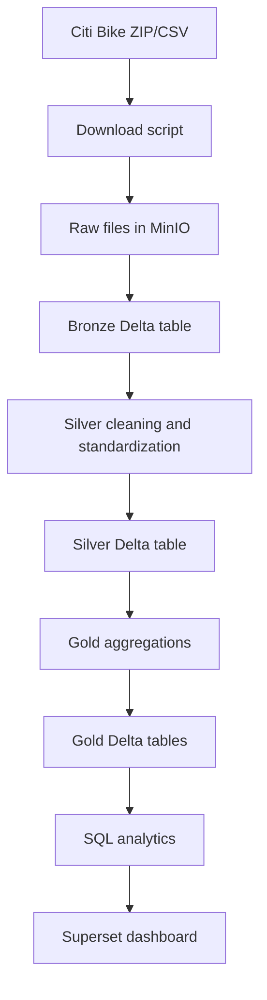

# End-to-End Data Flow

## Step 1: Source to Raw

`scripts/download_citibike_data.py` downloads monthly Citi Bike files and uploads both the ZIP and extracted CSV to MinIO. For offline demos, `scripts/create_demo_data.py` uploads a small sample CSV.

## Step 2: Raw to Bronze

`src/jobs/ingest_bronze.py` reads raw CSV files from `s3a://lakehouse/raw/citibike` and writes a Bronze Delta table. It preserves source columns and adds:

- `ingestion_timestamp`
- `source_file`
- `data_layer = bronze`

## Step 3: Bronze to Silver

`src/jobs/transform_silver.py` normalizes column names, casts timestamps and
coordinates, removes trips with missing/invalid required coordinates or invalid
time ranges, and creates derived columns:

- `trip_duration_minutes`
- `start_date`
- `start_hour`
- `day_of_week`
- `month`
- `is_weekend`
- `distance_km`

## Step 4: Silver to Gold

`src/jobs/build_gold.py` creates seven analytics-ready tables for daily rides, hourly demand, station popularity, user behavior, bike type usage, and OD pairs.

## Step 5: Gold to Analytics

Gold tables can be queried with Spark SQL or registered in Trino. Superset can connect to Trino for dashboard creation.
