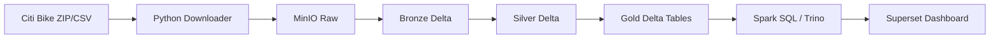

# Báo Cáo Cuối Kỳ: Docker-Based Data Lakehouse Cho Phân Tích NYC Citi Bike

## 1. Tên đề tài

Thiết kế và triển khai Data Lakehouse chạy local bằng Docker để phân tích dữ liệu chuyến đi NYC Citi Bike sử dụng Apache Spark, Delta Lake, MinIO, Trino và Superset.

## 2. Mục tiêu đề tài

Mục tiêu của đề tài là xây dựng một hệ thống Data Lakehouse hoàn chỉnh ở mức demo, có thể chạy trên máy cá nhân bằng Docker Compose mà không cần sử dụng dịch vụ cloud trả phí. Hệ thống cần nạp dữ liệu Citi Bike, lưu trữ theo kiến trúc Bronze/Silver/Gold, xử lý bằng Spark, lưu bảng bằng Delta Lake, và cung cấp dữ liệu phân tích cho SQL/dashboard.

## 3. Lý do chọn đề tài

Dữ liệu Citi Bike là dữ liệu thực tế, có kích thước lớn theo từng tháng, chứa thông tin thời gian, vị trí, loại xe và loại người dùng. Dataset này phù hợp để minh họa các vấn đề thường gặp trong Big Data Analytics như ingest file lớn, làm sạch dữ liệu, chuẩn hóa schema, tính toán chỉ số, phân vùng dữ liệu và xây dựng bảng phục vụ phân tích.

## 4. Tổng quan Data Lakehouse

Data Lakehouse là kiến trúc kết hợp ưu điểm của Data Lake và Data Warehouse. Data Lake có khả năng lưu trữ dữ liệu lớn, linh hoạt và chi phí thấp, trong khi Data Warehouse mạnh về quản lý bảng, schema và truy vấn phân tích. Lakehouse bổ sung table format như Delta Lake trên object storage để dữ liệu trong lake có transaction log, schema management và khả năng phục vụ phân tích đáng tin cậy hơn.

## 5. 5 lớp trong kiến trúc Lakehouse

| Lớp | Chức năng | Công cụ trong dự án |
|---|---|---|
| Data Source / Ingestion | Thu thập dữ liệu nguồn và đưa vào hệ thống | Python downloader, Spark Bronze job |
| Storage | Lưu raw data và bảng xử lý | MinIO |
| Table Format | Quản lý bảng, schema và transaction | Delta Lake |
| Processing | Làm sạch, biến đổi, tổng hợp dữ liệu | Apache Spark / PySpark |
| Serving / Analytics | Truy vấn, báo cáo, dashboard | Spark SQL, Trino, Superset |

## 6. Công cụ sử dụng

- Docker Compose: chạy toàn bộ hệ thống local.
- MinIO: object storage tương thích S3, thay thế AWS S3.
- Apache Spark: xử lý dữ liệu phân tán.
- Delta Lake: định dạng bảng có ACID transaction.
- JupyterLab: phát triển và demo notebook.
- Trino: query engine SQL cho dữ liệu curated.
- Superset: công cụ dashboard/BI.
- Python: viết downloader, ETL jobs và kiểm thử.

## 7. Kiến trúc hệ thống



Hệ thống chạy trên Docker Compose. MinIO lưu toàn bộ dữ liệu. Spark đọc ghi dữ liệu qua giao thức `s3a://`. Các bảng Bronze, Silver và Gold đều được lưu dưới dạng Delta Lake.

## 8. Luồng xử lý dữ liệu

Luồng dữ liệu gồm các bước:

1. Tải file Citi Bike theo tháng từ nguồn chính thức.
2. Upload file raw vào MinIO bucket `lakehouse`.
3. Spark đọc CSV raw và ghi bảng Bronze Delta.
4. Spark đọc Bronze, làm sạch và tạo bảng Silver Delta.
5. Spark đọc Silver và tạo các bảng Gold phục vụ phân tích.
6. Người dùng truy vấn Gold bằng Spark SQL hoặc Trino.
7. Superset dùng dữ liệu Gold để tạo dashboard.

## 9. Mô tả dataset

Dataset sử dụng là NYC Citi Bike System Data. Mỗi dòng dữ liệu tương ứng với một chuyến đi xe đạp. Các cột quan trọng gồm:

- `ride_id`
- `rideable_type`
- `started_at`, `ended_at`
- `start_station_name`, `end_station_name`
- `start_lat`, `start_lng`, `end_lat`, `end_lng`
- `member_casual`

Các vấn đề chất lượng dữ liệu có thể gặp: thiếu station, thiếu tọa độ, timestamp không hợp lệ, chuyến đi có thời lượng âm hoặc bằng 0, và khác biệt schema giữa các giai đoạn dữ liệu.

## 10. Thiết kế Bronze/Silver/Gold

### Bronze

Bronze lưu dữ liệu gần với raw nhất. Job `ingest_bronze.py` đọc CSV từ MinIO và thêm metadata:

- `ingestion_timestamp`
- `source_file`
- `data_layer = bronze`

### Silver

Silver làm sạch và chuẩn hóa dữ liệu. Các xử lý chính:

- Chuẩn hóa tên cột.
- Ép kiểu `started_at`, `ended_at` sang timestamp.
- Loại bỏ dòng thiếu `ride_id`, thiếu thời gian hoặc `ended_at <= started_at`.
- Tính `trip_duration_minutes`.
- Tạo `start_date`, `start_hour`, `day_of_week`, `month`, `is_weekend`.
- Tính `distance_km` bằng công thức Haversine.

### Gold

Gold chứa các bảng tổng hợp phục vụ trực tiếp cho phân tích và dashboard.

## 11. Các bảng phân tích Gold

| Bảng | Mục đích |
|---|---|
| `gold_daily_rides` | Số chuyến theo ngày, phân tách member/casual |
| `gold_hourly_demand` | Nhu cầu theo thứ trong tuần và giờ |
| `gold_top_start_stations` | Trạm bắt đầu phổ biến |
| `gold_top_end_stations` | Trạm kết thúc phổ biến |
| `gold_user_type_behavior` | So sánh hành vi member và casual |
| `gold_bike_type_usage` | Mức sử dụng theo loại xe |
| `gold_station_od_pairs` | Cặp trạm xuất phát - kết thúc phổ biến |

## 12. Kết quả truy vấn và dashboard đề xuất

Các câu hỏi phân tích:

1. Ngày nào có số chuyến cao nhất?
2. Khung giờ nào có nhu cầu cao nhất?
3. Trạm nào là điểm xuất phát phổ biến nhất?
4. Trạm nào là điểm kết thúc phổ biến nhất?
5. Member và casual khác nhau như thế nào?
6. Loại xe nào được sử dụng nhiều nhất?
7. Cuối tuần có khác ngày thường không?
8. Cặp origin-destination nào phổ biến nhất?

Dashboard đề xuất gồm line chart số chuyến theo ngày, heatmap nhu cầu theo giờ, bar chart top stations, bảng so sánh user type, bar chart bike type và bảng OD pairs.

## 13. Hướng dẫn demo

Chạy hệ thống:

```bash
cp .env.example .env
make up
make init
make sample-data
make pipeline
make validate
```

Mở các giao diện:

- MinIO: `http://localhost:9001`
- Spark UI: `http://localhost:8080`
- JupyterLab: `http://localhost:8888`
- Superset: `http://localhost:8088` sau khi chạy `make up-full`

Trong demo, trình bày lần lượt raw data trong MinIO, bảng Bronze/Silver/Gold và kết quả query Gold.

## 14. Bảng phân công công việc cho nhóm 4 người

| Thành viên | Công việc |
|---|---|
| Sinh viên 1 | Thiết kế kiến trúc, Docker Compose, MinIO, cấu hình Spark |
| Sinh viên 2 | Viết downloader, Bronze ingestion, quản lý raw data |
| Sinh viên 3 | Xây dựng Silver transformation, data quality checks, Haversine distance |
| Sinh viên 4 | Xây dựng Gold tables, SQL analytics, dashboard và tài liệu báo cáo |

Nếu nhóm có 2 hoặc 3 người, có thể gộp vai trò Docker/ingestion và dashboard/documentation.

## 15. Đánh giá kết quả

Dự án đã xây dựng được pipeline Lakehouse chạy local, không phụ thuộc cloud trả phí. Dữ liệu được tổ chức rõ ràng theo Bronze/Silver/Gold. Spark xử lý dữ liệu và ghi Delta Lake. Các bảng Gold trả lời trực tiếp các câu hỏi phân tích về nhu cầu sử dụng xe, hành vi người dùng, trạm phổ biến và loại xe.

## 16. Hạn chế

- Demo local phụ thuộc tài nguyên máy cá nhân.
- Trino/Superset có thể cần cấu hình thêm tùy phiên bản connector.
- Dữ liệu nhiều tháng có thể tốn dung lượng và thời gian xử lý.
- Chưa triển khai orchestration chuyên nghiệp như Airflow.
- Chưa có dashboard export tự động.

## 17. Hướng phát triển

- Bổ sung Airflow để lập lịch pipeline.
- Thêm kiểm thử dữ liệu nâng cao bằng Great Expectations.
- Tối ưu Delta table bằng compaction/Z-order.
- Thêm dữ liệu thời tiết để phân tích ảnh hưởng của thời tiết đến nhu cầu đi xe.
- Triển khai dashboard Superset hoàn chỉnh và export metadata.
- Mở rộng sang mô hình incremental ingestion.

## 18. Tài liệu tham khảo

- NYC Citi Bike System Data: <https://citibikenyc.com/system-data>
- Apache Spark Documentation: <https://spark.apache.org/docs/latest/>
- Delta Lake Documentation: <https://docs.delta.io/latest/index.html>
- MinIO Documentation: <https://min.io/docs/minio/container/index.html>
- Trino Documentation: <https://trino.io/docs/current/>
- Apache Superset Documentation: <https://superset.apache.org/docs/intro>
