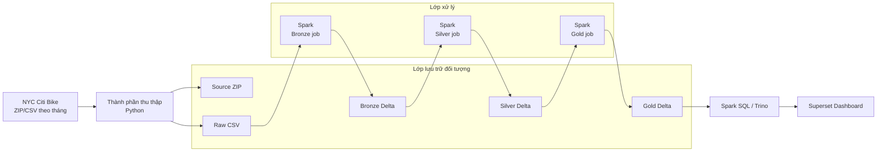
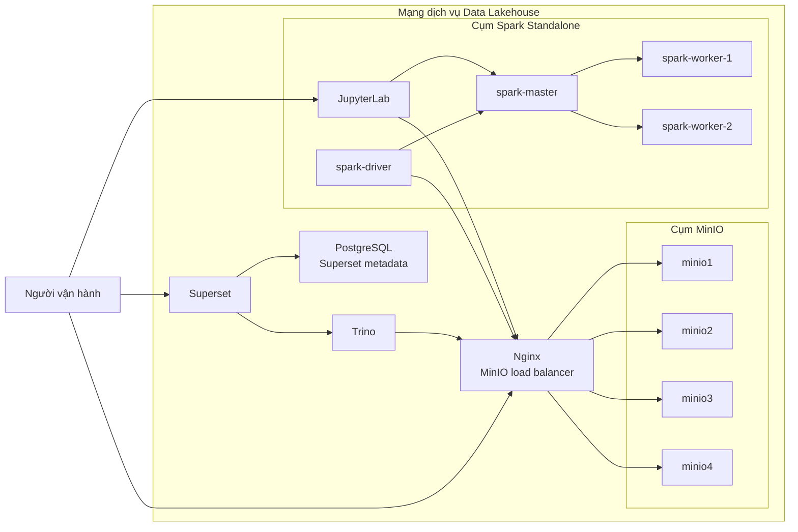
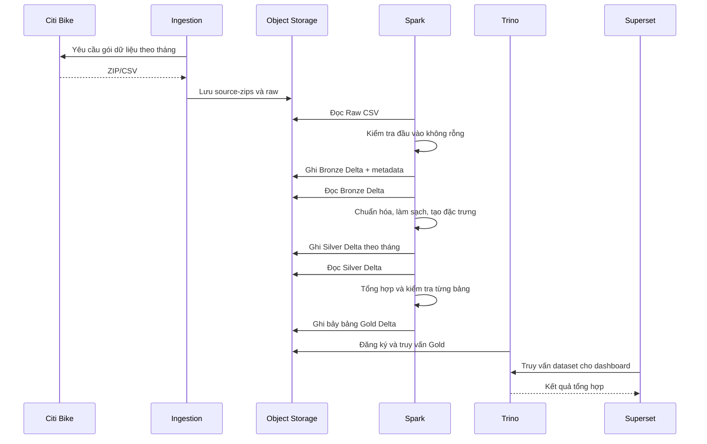

# Chương 3. Phân tích, thiết kế và triển khai hệ thống

Chương này trình bày quá trình phân tích dữ liệu đầu vào, xác định yêu cầu và thiết
kế hệ thống Data Lakehouse phục vụ phân tích dữ liệu chuyến đi NYC Citi Bike. Nội
dung đi từ cấu trúc logic và vai trò của từng thành phần đến cách tổ chức dữ liệu,
triển khai hạ tầng và hiện thực luồng biến đổi từ dữ liệu nguồn đến dữ liệu phục vụ
truy vấn. Cách trình bày này giúp duy trì mối liên hệ trực tiếp giữa quyết định
thiết kế và thành phần đã được xây dựng trong hệ thống.

## 3.1. Phân tích bộ dữ liệu NYC Citi Bike

### 3.1.1. Nguồn và phạm vi dữ liệu

Dữ liệu được sử dụng trong đề tài là bộ lịch sử chuyến đi do Citi Bike công bố
trên trang System Data [1]. Dữ liệu được phát hành theo từng tháng dưới dạng tệp
nén. Mỗi bản ghi mô tả một chuyến đi, bao gồm mã chuyến, loại xe, thời điểm bắt
đầu và kết thúc, trạm xuất phát và trạm kết thúc, tọa độ hai đầu chuyến đi và loại
người dùng. Theo mô tả của đơn vị cung cấp, khi số chuyến trong một tháng vượt
quá một triệu, tệp nén của tháng đó có thể chứa nhiều tệp CSV; do đó hệ thống phải
đọc toàn bộ các tệp CSV thay vì giả định mỗi tháng chỉ có một tệp.

Phạm vi thời gian không được cố định trong mã nguồn. Danh sách tháng được truyền
vào hệ thống dưới dạng tham số `YYYYMM`, nhờ đó cùng một pipeline có thể xử lý
một hoặc nhiều tháng mà không thay đổi logic chương trình. Khoảng thời gian, dung
lượng và số lượng bản ghi thực sự dùng trong thực nghiệm sẽ được trình bày tại
Chương 4.

Đề tài sử dụng dữ liệu lịch sử chuyến đi theo phương thức xử lý theo lô. Nguồn dữ
liệu thời gian thực theo chuẩn GBFS mà Citi Bike cung cấp không thuộc phạm vi
hiện tại. Đây là một hướng mở rộng phù hợp khi hệ thống được bổ sung cơ chế thu
thập và xử lý dòng dữ liệu.

### 3.1.2. Cấu trúc dữ liệu

Ở dữ liệu nguồn, mỗi dòng tương ứng với một chuyến đi. Các trường chính được mô
tả trong Bảng 3.1.

**Bảng 3.1. Từ điển dữ liệu chuyến đi Citi Bike**

| Trường | Kiểu sau chuẩn hóa | Ý nghĩa |
|---|---|---|
| `ride_id` | String | Mã định danh chuyến đi |
| `rideable_type` | String | Loại xe được sử dụng |
| `started_at` | Timestamp | Thời điểm bắt đầu chuyến đi |
| `ended_at` | Timestamp | Thời điểm kết thúc chuyến đi |
| `start_station_name` | String | Tên trạm xuất phát |
| `start_station_id` | String | Mã trạm xuất phát |
| `end_station_name` | String | Tên trạm kết thúc |
| `end_station_id` | String | Mã trạm kết thúc |
| `start_lat` | Double | Vĩ độ điểm xuất phát |
| `start_lng` | Double | Kinh độ điểm xuất phát |
| `end_lat` | Double | Vĩ độ điểm kết thúc |
| `end_lng` | Double | Kinh độ điểm kết thúc |
| `member_casual` | String | Nhóm người dùng: thành viên hoặc khách vãng lai |

Pipeline không suy luận kiểu dữ liệu ngay khi đọc tệp CSV. Toàn bộ trường nguồn
được giữ dưới dạng chuỗi ở lớp Bronze và chỉ được ép kiểu ở lớp Silver. Cách làm
này giúp Bronze bảo toàn biểu diễn đầu vào, đồng thời tránh việc một giá trị bất
thường làm thay đổi schema được Spark suy luận cho toàn bộ tập dữ liệu.

Bên cạnh các trường nguồn, hệ thống bổ sung metadata để hỗ trợ truy vết:

- `ingestion_timestamp`: thời điểm bản ghi được nạp vào Lakehouse;
- `source_file`: đường dẫn của tệp nguồn chứa bản ghi;
- `data_layer`: lớp dữ liệu hiện tại, nhận giá trị `bronze` hoặc `silver`.

Sau khi làm sạch, Silver bổ sung các đặc trưng dẫn xuất trong Bảng 3.2.

**Bảng 3.2. Các đặc trưng được tạo tại lớp Silver**

| Trường | Kiểu dữ liệu | Cách xác định |
|---|---|---|
| `trip_duration_minutes` | Double | Hiệu giữa `ended_at` và `started_at`, đổi sang phút |
| `start_date` | Date | Ngày bắt đầu chuyến đi |
| `start_hour` | Integer | Giờ bắt đầu, từ 0 đến 23 |
| `day_of_week` | String | Tên ngày trong tuần |
| `day_of_week_num` | Integer | Số thứ tự ngày theo quy ước của Spark |
| `month` | String | Tháng bắt đầu theo định dạng `yyyy-MM` |
| `is_weekend` | Boolean | Đúng khi chuyến đi bắt đầu vào thứ Bảy hoặc Chủ nhật |
| `distance_km` | Double | Khoảng cách đường chim bay theo công thức Haversine |

`distance_km` là khoảng cách địa lý giữa tọa độ đầu và cuối, không phải chiều dài
tuyến đường thực tế mà xe đã di chuyển. Do đó chỉ số này phù hợp để so sánh tương
đối giữa các nhóm chuyến đi và không được diễn giải như quãng đường chính xác.

### 3.1.3. Các vấn đề chất lượng và không đồng nhất dữ liệu

Trang dữ liệu chính thức cho thấy cấu trúc Citi Bike đã thay đổi theo thời gian:
định dạng hiện tại dùng các trường như `ride_id`, `started_at` và
`member_casual`, trong khi định dạng cũ dùng `starttime`, `stoptime` và
`usertype` [1]. Ngoài khác biệt tên cột, quá trình xử lý còn phải xét các rủi ro
chất lượng sau:

- thiếu mã chuyến đi;
- thời gian bắt đầu hoặc kết thúc không chuyển được sang kiểu timestamp;
- thời điểm kết thúc không lớn hơn thời điểm bắt đầu;
- thiếu tên hoặc mã trạm;
- thiếu hoặc sai kiểu tọa độ;
- giá trị loại người dùng không thống nhất giữa `member/casual` và
  `Subscriber/Customer`;
- tên cột khác nhau về chữ hoa, chữ thường, khoảng trắng hoặc ký tự phân cách;
- một mã chuyến đi có thể xuất hiện nhiều lần khi tổng hợp nhiều tệp.

Thiết kế Silver hiện tại xử lý trực tiếp các trường hợp ảnh hưởng đến khả năng xác
định một chuyến đi hợp lệ: thiếu `ride_id`, timestamp không hợp lệ và thời lượng
không dương. Các bản ghi thiếu tên trạm vẫn được giữ để không làm mất những phân
tích không phụ thuộc trạm, nhưng bị loại khỏi các bảng Gold về trạm. Ngược lại,
bốn tọa độ là đầu vào bắt buộc của phép tính Haversine; bản ghi thiếu tọa độ hoặc
có tọa độ không chuyển được sang kiểu số sẽ bị loại khỏi Silver.

Hệ thống có đo số lượng `ride_id` phân biệt để phát hiện nguy cơ trùng lặp, nhưng
phiên bản hiện tại chưa thực hiện loại trùng. Số bản ghi lỗi, tỷ lệ giữ lại sau làm
sạch và mức độ trùng lặp phải được đo trên dữ liệu thực nghiệm, vì vậy các kết quả
định lượng này được dành cho Chương 4.

## 3.2. Yêu cầu hệ thống

### 3.2.1. Yêu cầu chức năng

Từ bài toán và đặc điểm dữ liệu, hệ thống cần đáp ứng các yêu cầu chức năng sau:

1. **Thu thập dữ liệu theo tháng.** Hệ thống nhận một danh sách tháng, tải các
   gói dữ liệu tương ứng và xử lý được trường hợp một gói chứa nhiều tệp CSV.
2. **Bảo toàn dữ liệu nguồn.** Tệp nén và tệp CSV sau giải nén được lưu riêng để
   có thể kiểm tra hoặc tái xử lý khi logic biến đổi thay đổi.
3. **Tạo lớp Bronze có khả năng truy vết.** Dữ liệu được nạp gần với trạng thái
   nguồn và được bổ sung thời điểm nạp, tệp nguồn và nhãn lớp dữ liệu.
4. **Chuẩn hóa và làm sạch dữ liệu.** Hệ thống chuẩn hóa tên cột, ép kiểu, thống
   nhất giá trị phân loại và loại các chuyến không đủ điều kiện thời gian.
5. **Tạo đặc trưng phục vụ phân tích.** Các thuộc tính thời lượng, ngày, giờ,
   cuối tuần và khoảng cách được tính tại lớp Silver để tái sử dụng.
6. **Tạo dữ liệu chuyên biệt cho truy vấn.** Lớp Gold phải trả lời được các câu
   hỏi về xu hướng theo ngày, nhu cầu theo giờ, trạm phổ biến, hành vi người dùng,
   loại xe và cặp trạm xuất phát–kết thúc.
7. **Hỗ trợ nhiều phương thức tiêu thụ.** Dữ liệu Gold có thể được đọc bằng
   Spark, truy vấn bằng SQL và sử dụng để xây dựng dashboard.
8. **Kiểm tra đầu ra của pipeline.** Pipeline phải dừng khi đầu vào rỗng, đồng
   thời kiểm tra sự tồn tại của các cột bắt buộc và dữ liệu đầu ra của từng bảng.

### 3.2.2. Yêu cầu phi chức năng

Ngoài chức năng xử lý dữ liệu, hệ thống được thiết kế theo các yêu cầu phi chức
năng sau:

- **Khả năng tái lập:** cấu hình, mã nguồn và thứ tự chạy phải cho phép triển khai
  lại môi trường và tạo lại các bảng từ dữ liệu nguồn.
- **Khả năng mở rộng:** lưu trữ và xử lý được tách rời; khối lượng xử lý có thể
  tăng bằng cách bổ sung tài nguyên cho cụm tính toán hoặc lưu trữ.
- **Tính mô-đun:** thu thập, Bronze, Silver, Gold, truy vấn và trực quan hóa là
  các thành phần có trách nhiệm riêng.
- **Khả năng truy vết:** bản ghi đã nạp phải xác định được tệp nguồn và thời điểm
  nạp; dữ liệu thô không bị thay thế bởi dữ liệu đã làm sạch.
- **Tính nhất quán dữ liệu:** các bảng đã xử lý sử dụng table format có transaction
  log thay vì chỉ là tập hợp các tệp rời rạc.
- **Khả năng kiểm thử:** logic chuẩn hóa, biến đổi và tính toán địa lý có thể được
  kiểm thử độc lập với toàn bộ pipeline.
- **Khả năng quan sát cơ bản:** các công đoạn ghi log đường dẫn, số lượng bản ghi
  và trạng thái kiểm tra để hỗ trợ phát hiện lỗi.

## 3.3. Kiến trúc tổng thể

Hệ thống được tổ chức theo hướng tách biệt nguồn dữ liệu, lưu trữ, xử lý, quản lý
bảng và lớp tiêu thụ. Hình 3.1 mô tả luồng dữ liệu và quan hệ giữa các thành phần.



**Hình 3.1. Kiến trúc logic tổng thể của hệ thống**

Các thành phần trong kiến trúc có trách nhiệm như sau:

- **Nguồn Citi Bike** cung cấp các tệp lịch sử chuyến đi theo tháng.
- **Thành phần thu thập** tải dữ liệu, lưu bản nén và giải nén toàn bộ tệp CSV
  vào vùng Raw.
- **Hệ thống lưu trữ đối tượng** là nơi lưu thống nhất dữ liệu nguồn và các bảng
  Bronze, Silver, Gold. Trong đề tài, MinIO cung cấp giao diện tương thích S3 và
  đóng vai trò lớp lưu trữ độc lập với lớp tính toán [4].
- **Apache Spark** thực hiện các tác vụ đọc, chuẩn hóa, làm sạch, tạo đặc trưng và
  tổng hợp dữ liệu. Spark được lựa chọn vì hỗ trợ xử lý dữ liệu có cấu trúc trên
  mô hình tính toán phân tán [2].
- **Delta Lake** quản lý các lớp Bronze, Silver và Gold dưới dạng bảng có
  transaction log. Delta Lake bổ sung giao dịch ACID, quản lý schema và phiên bản
  trên lớp lưu trữ dữ liệu [3].
- **Spark SQL và Trino** cung cấp hai đường truy cập dữ liệu Gold. Spark SQL phù
  hợp với kiểm tra trực tiếp trong pipeline; Trino tách workload truy vấn tương
  tác khỏi workload ETL và cung cấp kết nối SQL cho lớp BI [5].
- **Apache Superset** sử dụng các dataset từ lớp truy vấn để xây dựng biểu đồ và
  dashboard [6].

Kiến trúc này tách storage khỏi compute: dữ liệu được duy trì trong lớp lưu trữ,
trong khi Spark và Trino truy cập dữ liệu theo từng workload. Sự tách biệt giúp
giảm phụ thuộc giữa nơi lưu dữ liệu với công cụ xử lý, đồng thời cho phép thay đổi
hoặc mở rộng từng lớp mà không phải di chuyển toàn bộ dữ liệu.

## 3.4. Lựa chọn công nghệ

Việc lựa chọn công nghệ dựa trên mức độ phù hợp với vai trò kiến trúc, khả năng
tích hợp qua giao diện mở và khả năng tái lập hệ thống. Bảng 3.3 tóm tắt các lựa
chọn chính.

**Bảng 3.3. Công nghệ và vai trò trong hệ thống**

| Công nghệ | Vai trò | Lý do lựa chọn | Phương án thay thế |
|---|---|---|---|
| Python | Thu thập dữ liệu, điều phối tác vụ tiện ích và viết PySpark | Hệ sinh thái thư viện dữ liệu phong phú, đồng nhất ngôn ngữ giữa ingestion và ETL | Scala, Java |
| MinIO | Lưu tệp nguồn và bảng Lakehouse | API tương thích S3, tách storage khỏi compute, hỗ trợ mô hình lưu trữ đối tượng | Amazon S3, Azure Data Lake Storage, HDFS |
| Apache Spark | Xử lý Bronze, Silver và Gold | DataFrame API, Spark SQL và khả năng thực thi phân tán phù hợp với biến đổi dữ liệu lớn | Apache Flink, Hadoop MapReduce |
| Delta Lake | Table format cho các lớp dữ liệu | Transaction log, ACID, schema enforcement và khả năng đọc từ nhiều engine | Apache Iceberg, Apache Hudi |
| Trino | Query engine cho lớp phục vụ | Truy vấn SQL trực tiếp trên bảng Delta và cung cấp giao diện cho công cụ BI | Spark Thrift Server, Presto |
| Apache Superset | Trực quan hóa và dashboard | Kết nối SQL, hỗ trợ nhiều loại biểu đồ và dashboard tương tác | Metabase, Grafana |

Các công nghệ được chọn không đại diện cho cách duy nhất để xây dựng Lakehouse.
Giá trị của thiết kế nằm ở ranh giới rõ ràng giữa các lớp và giao diện kết nối giữa
chúng. Phương thức đóng gói, cấu hình mạng và khởi tạo các dịch vụ được trình bày
tại Mục 3.6.

## 3.5. Thiết kế lưu trữ và mô hình dữ liệu

### 3.5.1. Cấu trúc vùng lưu trữ

Hệ thống sử dụng một bucket logic có tên mặc định là `lakehouse`. Dữ liệu được
phân vùng theo mục đích sử dụng như sau:

```text
lakehouse/
├── source-zips/
│   └── citibike/
├── raw/
│   └── citibike/
├── bronze/
│   └── citibike/
├── silver/
│   └── citibike/
└── gold/
    └── citibike/
        ├── gold_daily_rides/
        ├── gold_hourly_demand/
        ├── gold_top_start_stations/
        ├── gold_top_end_stations/
        ├── gold_user_type_behavior/
        ├── gold_bike_type_usage/
        └── gold_station_od_pairs/
```

**Hình 3.2. Cấu trúc logic của vùng lưu trữ**

Vai trò của từng vùng được trình bày trong Bảng 3.4.

**Bảng 3.4. Phân vùng dữ liệu trong Lakehouse**

| Vùng | Nội dung | Định dạng | Mục đích |
|---|---|---|---|
| `source-zips` | Tệp nén tải từ nguồn | ZIP hoặc GZIP | Bảo toàn gói dữ liệu ban đầu |
| `raw` | Các tệp chuyến đi đã giải nén | CSV | Đầu vào trực tiếp cho Spark |
| `bronze` | Bản ghi nguồn kèm metadata | Delta | Truy vết và tái xử lý |
| `silver` | Chuyến đi đã chuẩn hóa và tạo đặc trưng | Delta, phân vùng theo `month` | Nguồn dữ liệu sạch dùng chung |
| `gold` | Các bảng tổng hợp chuyên biệt | Delta | Truy vấn phân tích và dashboard |

Việc giữ cả `source-zips` và `raw` tạo ra hai mức bảo toàn. Gói nén cho phép đối
chiếu với tệp được phát hành, còn CSV cho phép chạy lại pipeline mà không cần tải
và giải nén lại dữ liệu. Bronze không thay thế Raw; đây là lớp bảng hóa dữ liệu để
Spark và các công cụ khác có thể xử lý nhất quán.

### 3.5.2. Thiết kế bảng Bronze

Bronze giữ nguyên tên và giá trị của các cột nguồn dưới dạng chuỗi, sau đó thêm
ba trường metadata. Bảng được ghi ở chế độ `overwrite` cho mỗi lần chạy toàn bộ
pipeline. Cách ghi này phù hợp với kịch bản batch có thể tái lập của phiên bản hiện
tại, nhưng chưa phải thiết kế incremental.

**Bảng 3.5. Metadata của bảng Bronze**

| Trường | Kiểu dữ liệu | Mô tả |
|---|---|---|
| Các cột nguồn | String | Giá trị đọc trực tiếp từ CSV |
| `ingestion_timestamp` | Timestamp | Thời điểm Spark nạp bản ghi |
| `source_file` | String | Tệp CSV chứa bản ghi |
| `data_layer` | String | Giá trị cố định `bronze` |

Bronze không loại bản ghi lỗi và không ép kiểu nghiệp vụ. Điểm kiểm tra bắt buộc
ở bước này là tập dữ liệu đầu vào không được rỗng. Việc trì hoãn làm sạch sang
Silver giúp duy trì ranh giới rõ ràng giữa dữ liệu đã tiếp nhận và dữ liệu đủ điều
kiện phân tích.

### 3.5.3. Thiết kế bảng Silver

Silver có grain là **một dòng cho một bản ghi chuyến đi hợp lệ theo điều kiện thời
gian**. Bảng chứa các trường chuẩn hóa trong Bảng 3.1, các đặc trưng dẫn xuất trong
Bảng 3.2 và metadata kế thừa từ Bronze.

Quá trình chuẩn hóa hỗ trợ cả tên cột hiện tại và một số tên cột cũ. Ví dụ:

- `starttime` được ánh xạ thành `started_at`;
- `stoptime` được ánh xạ thành `ended_at`;
- `usertype` được ánh xạ thành `member_casual`;
- `Subscriber` được chuẩn hóa thành `member`;
- `Customer` được chuẩn hóa thành `casual`.

Một bản ghi được đưa vào Silver khi thỏa mãn:

$$
\text{ride\_id} \neq \text{null}
$$

$$
\text{started\_at} \neq \text{null}
\land
\text{ended\_at} \neq \text{null}
\land
\text{ended\_at} > \text{started\_at}
$$

Thời lượng chuyến đi được tính theo:

$$
\text{trip\_duration\_minutes}
=
\frac{\text{ended\_at}-\text{started\_at}}{60}
$$

Khoảng cách được tính bằng công thức Haversine với bán kính Trái Đất
$R=6371{,}0088$ km. Chi tiết cơ sở toán học của công thức được trình bày tại
Chương 2.

Silver được phân vùng vật lý theo `month`. Thuộc tính này thường xuất hiện trong
điều kiện lọc thời gian và có số lượng giá trị tăng chậm, phù hợp hơn việc phân
vùng theo ngày hoặc theo trạm trong phạm vi dữ liệu hiện tại.

### 3.5.4. Thiết kế các bảng Gold

Thay vì yêu cầu dashboard tổng hợp trực tiếp từ bảng Silver ở mỗi truy vấn, hệ
thống tạo bảy bảng Gold theo từng nhóm câu hỏi phân tích. Grain, chiều phân tích và
chỉ số của mỗi bảng được mô tả trong Bảng 3.6.

**Bảng 3.6. Thiết kế các bảng Gold**

| Bảng | Grain | Chiều phân tích | Chỉ số |
|---|---|---|---|
| `gold_daily_rides` | Một ngày | `ride_date` | `total_rides`, `member_rides`, `casual_rides`, `avg_duration_minutes`, `avg_distance_km` |
| `gold_hourly_demand` | Một ngày trong tuần và một giờ | `day_of_week`, `start_hour` | `total_rides`, `avg_duration_minutes` |
| `gold_top_start_stations` | Một trạm xuất phát | `start_station_name` | `total_starts`, `avg_duration_minutes` |
| `gold_top_end_stations` | Một trạm kết thúc | `end_station_name` | `total_ends`, `avg_duration_minutes` |
| `gold_user_type_behavior` | Một loại người dùng | `member_casual` | `total_rides`, `avg_duration_minutes`, `avg_distance_km`, `weekend_rides`, `weekday_rides` |
| `gold_bike_type_usage` | Một loại xe | `rideable_type` | `total_rides`, `avg_duration_minutes`, `avg_distance_km` |
| `gold_station_od_pairs` | Một cặp trạm xuất phát–kết thúc | `start_station_name`, `end_station_name` | `total_rides`, `avg_duration_minutes` |

`gold_daily_rides` được phân vùng theo `ride_date`; sáu bảng còn lại không phân
vùng vì số dòng sau tổng hợp tương đối nhỏ trong phạm vi đề tài. Toàn bộ bảng Gold
được tái tạo bằng chế độ `overwrite` mỗi lần chạy pipeline.

Thiết kế nhiều bảng chuyên biệt giúp truy vấn dashboard đơn giản và giảm lượng dữ
liệu phải quét. Đổi lại, một số chiều đã bị loại khỏi từng bảng tổng hợp. Chẳng
hạn, bảng trạm không chứa ngày hoặc loại người dùng, vì vậy bộ lọc thời gian hay
`member_casual` không thể áp dụng trực tiếp lên biểu đồ trạm. Đây là đánh đổi có
chủ đích của mô hình Gold hiện tại và cần được xem xét nếu dashboard sau này yêu
cầu các bộ lọc toàn cục.

## 3.6. Triển khai hạ tầng hệ thống

### 3.6.1. Tổ chức mã nguồn

Mã nguồn được chia theo trách nhiệm của từng thành phần thay vì tập trung toàn bộ
logic vào một chương trình duy nhất. Cấu trúc chính của dự án gồm:

```text
ProjectBigdata/
├── config/                 # Cấu hình Spark, MinIO, Trino, Superset và Nginx
├── dashboard/              # Thiết kế và hướng dẫn xây dựng dashboard
├── docker/                 # Dockerfile tùy biến cho Spark và Superset
├── docs/                   # Tài liệu kiến trúc, dữ liệu và vận hành
├── scripts/                # Thu thập dữ liệu, khởi tạo và điều phối pipeline
├── sql/                    # Truy vấn Spark SQL và Trino
├── src/
│   ├── jobs/               # Các job Bronze, Silver, Gold và validation
│   ├── quality/            # Kiểm tra chất lượng dữ liệu
│   └── utils/              # Spark session, S3, đường dẫn và hàm địa lý
└── tests/                  # Unit test cho biến đổi và tính toán
```

**Hình 3.3. Cấu trúc tổ chức mã nguồn**

Các job xử lý chỉ chứa logic của một công đoạn. Cấu hình kết nối và đường dẫn được
đưa vào `src/utils`, còn các quy tắc chất lượng được đặt trong `src/quality`.
Cách tổ chức này giảm phụ thuộc giữa logic nghiệp vụ với môi trường triển khai và
cho phép kiểm thử từng phần độc lập.

### 3.6.2. Kiến trúc triển khai bằng Docker Compose

Docker Compose được sử dụng để hiện thực các thành phần logic ở Hình 3.1 thành
những dịch vụ độc lập trong cùng một mạng. Docker không thay đổi vai trò của các
thành phần trong Lakehouse; nó cung cấp môi trường triển khai có thể tái lập, cô
lập phụ thuộc và mô phỏng sự giao tiếp giữa các node lưu trữ, node xử lý và lớp
phục vụ.



**Hình 3.4. Kiến trúc triển khai các dịch vụ**

Các phiên bản chính được cố định trong tệp cấu hình và Dockerfile để hạn chế sai
khác giữa các lần triển khai.

**Bảng 3.7. Phiên bản các thành phần chính**

| Thành phần | Phiên bản/cấu hình trong dự án | Vai trò triển khai |
|---|---|---|
| Apache Spark | 3.5.1 | Cụm xử lý phân tán và môi trường chạy PySpark |
| Delta Lake | 3.2.0 | Table format cho Bronze, Silver và Gold |
| MinIO | `RELEASE.2024-06-13T22-53-53Z` | Cụm lưu trữ đối tượng |
| Trino | 449 | Query engine cho các bảng Delta |
| Apache Superset | 3.1.3 | Dashboard và trực quan hóa |
| PostgreSQL | 15 | Lưu metadata của Superset |
| Nginx | 1.25 | Điểm truy cập và cân bằng tải cho cụm MinIO |

### 3.6.3. Triển khai lớp lưu trữ

Lớp lưu trữ gồm bốn dịch vụ `minio1` đến `minio4`. Mỗi node gắn với một volume
riêng để dữ liệu không phụ thuộc vào vòng đời của container. Các node cùng tham
gia một cụm lưu trữ phân tán và được truy cập thông qua dịch vụ Nginx. Nginx cung
cấp một endpoint thống nhất cho S3 API và MinIO Console, nhờ đó Spark, Trino và
các tiện ích ingestion không cần biết vị trí của từng node.

Mỗi node MinIO có health check. Load balancer chỉ được khởi động sau khi các node
đạt trạng thái sẵn sàng. Bucket `lakehouse` được tạo bởi một dịch vụ công cụ riêng;
dịch vụ này chỉ chạy khi khởi tạo hệ thống và không phải là thành phần thường trực
của pipeline.

### 3.6.4. Triển khai lớp xử lý

Spark được triển khai theo chế độ Standalone với một `spark-master` và hai worker.
Master điều phối tài nguyên và cung cấp giao diện theo dõi; mỗi worker được cấu
hình một core và 2 GB bộ nhớ trong môi trường hiện tại. Các job không chạy trực
tiếp trong master. Dịch vụ `spark-driver` được tạo theo yêu cầu để gửi ứng dụng
đến cụm qua địa chỉ `spark://spark-master:7077`.

Image Spark được bổ sung thư viện Delta Lake, Hadoop AWS và AWS SDK để Spark đọc
ghi dữ liệu qua giao thức `s3a://`. Hàm tạo `SparkSession` thiết lập Delta
extension, Delta catalog, S3 endpoint, path-style access, thông tin xác thực và số
partition shuffle. JupyterLab sử dụng cùng image và cấu hình, cho phép kiểm tra dữ
liệu hoặc phát triển truy vấn mà không tạo ra một môi trường Spark khác biệt.

### 3.6.5. Triển khai lớp truy vấn và trực quan hóa

Trino được cấu hình với Delta Lake connector. Catalog sử dụng file metastore đặt
trên vùng lưu trữ đối tượng và native S3 filesystem để truy cập các bảng Gold.
Khác với Spark sử dụng URI `s3a://`, Trino đăng ký vị trí bảng bằng URI `s3://`;
cả hai cùng trỏ đến bucket `lakehouse`.

Superset được xây dựng từ image chính thức và cài thêm Trino client cùng
SQLAlchemy driver cho Trino. Metadata về tài khoản, database connection, dataset,
chart và dashboard được lưu trong PostgreSQL thay vì lưu trong container
Superset. Trino, Superset và PostgreSQL thuộc nhóm dịch vụ phân tích tùy chọn;
pipeline ETL có thể hoạt động mà không cần khởi động lớp BI.

### 3.6.6. Cấu hình và vận hành

Các tham số môi trường như endpoint, bucket, tài nguyên Spark, danh sách tháng và
cổng dịch vụ được tập trung trong tệp `.env`. Mã nguồn dự án và cấu hình Spark
được mount vào các container xử lý, trong khi dữ liệu MinIO và metadata Superset
được giữ trong các named volume.

`Makefile` cung cấp các điểm vào thống nhất cho những thao tác chính: khởi động
hạ tầng, khởi tạo bucket, tải dữ liệu, chạy từng lớp, chạy toàn pipeline, validation,
đăng ký bảng Trino và thực thi kiểm thử. Các lệnh vận hành chi tiết được đưa vào
phụ lục để phần nội dung chính tập trung vào kiến trúc và cách hiện thực.

## 3.7. Thiết kế và hiện thực luồng xử lý dữ liệu

### 3.7.1. Thu thập dữ liệu nguồn

Thành phần thu thập nhận danh sách tháng từ cấu hình. Với mỗi tháng, hệ thống lần
lượt thử các quy ước tên tệp mà nguồn Citi Bike sử dụng, tải gói dữ liệu và kiểm
tra phản hồi không rỗng. Tệp tải xuống được lưu vào `source-zips/citibike`. Nếu
đó là tệp ZIP, toàn bộ thành viên có phần mở rộng CSV được giải nén và tải lên
`raw/citibike`.

Việc lưu từng CSV với tên gốc cho phép Spark đọc nhiều tệp bằng một đường dẫn
chung, đồng thời giúp trường `source_file` ở Bronze xác định chính xác nguồn của
từng bản ghi.

### 3.7.2. Chuyển đổi Raw sang Bronze

Spark đọc tất cả tệp CSV trong vùng Raw với tùy chọn có dòng tiêu đề, không bật
`inferSchema` và không xử lý bản ghi nhiều dòng. Sau khi xác nhận đầu vào không
rỗng, job bổ sung `ingestion_timestamp`, `source_file` và `data_layer`, rồi ghi
toàn bộ dữ liệu thành bảng Delta tại vùng Bronze.

Ở bước này không có quy tắc nghiệp vụ nào được áp dụng. Mục tiêu của Bronze là
đưa dữ liệu từ tập hợp tệp nguồn sang dạng bảng có quản lý mà vẫn giữ khả năng
đối chiếu với đầu vào.

### 3.7.3. Chuyển đổi Bronze sang Silver

Luồng Bronze–Silver gồm sáu nhóm thao tác:

1. Chuẩn hóa tên cột về chữ thường và dấu gạch dưới.
2. Ánh xạ các tên cột cũ hoặc biến thể sang schema chuẩn.
3. Kiểm tra sự tồn tại của các cột bắt buộc.
4. Ép kiểu timestamp và tọa độ; chuẩn hóa loại người dùng và loại xe.
5. Lọc bản ghi thiếu khóa, thiếu tọa độ, tọa độ không chuyển được sang kiểu số,
   timestamp không hợp lệ hoặc thời lượng không dương.
6. Tạo đặc trưng thời gian, thời lượng và khoảng cách Haversine.

Kết quả được ghi thành bảng Silver phân vùng theo tháng. Trước khi ghi, hệ thống
tạo bản tóm tắt chất lượng gồm tổng số dòng, số `ride_id` phân biệt, số giá trị
null ở các trường thời gian và số chuyến có thời lượng không dương.

### 3.7.4. Chuyển đổi Silver sang Gold

Job Gold đọc bảng Silver, kiểm tra dữ liệu không rỗng và thực hiện các phép
`groupBy`/`agg` theo grain đã thiết kế trong Bảng 3.6. Các giá trị trung bình thời
lượng được làm tròn đến hai chữ số thập phân; khoảng cách trung bình được làm tròn
đến ba chữ số thập phân.

Trước khi ghi mỗi bảng, job kiểm tra kết quả không rỗng. Bảng được ghi dưới dạng
Delta và số dòng đầu ra được ghi vào log. Cách tổ chức này giúp lỗi của một phép
tổng hợp được phát hiện ngay tại bước xây dựng Gold thay vì chỉ xuất hiện khi
dashboard truy vấn.

### 3.7.5. Chuyển dữ liệu Gold đến lớp phục vụ

Các bảng Gold có thể được đọc trực tiếp bằng Spark để kiểm tra hoặc đăng ký với
Trino bằng vị trí vật lý trên lớp lưu trữ. Sau khi đăng ký, Trino cung cấp giao
diện SQL để Superset khai báo dataset và xây dựng biểu đồ.

Hình 3.5 tóm tắt trình tự xử lý và các điểm kiểm tra chính.



**Hình 3.5. Trình tự xử lý dữ liệu từ nguồn đến dashboard**

## 3.8. Kiểm soát chất lượng và kiểm thử

### 3.8.1. Quy tắc kiểm soát chất lượng

Các quy tắc chất lượng được đặt tại ranh giới phù hợp thay vì áp dụng đồng loạt
trên mọi lớp. Bảng 3.8 mô tả các quy tắc hiện có và cách hệ thống xử lý.

**Bảng 3.8. Quy tắc kiểm soát chất lượng dữ liệu**

| Quy tắc | Lớp áp dụng | Điều kiện | Cách xử lý hiện tại | Mục đích |
|---|---|---|---|---|
| Đầu vào không rỗng | Raw, Silver và từng bảng Gold | Có ít nhất một dòng | Dừng job và phát sinh lỗi | Tránh tạo bảng rỗng do sai đường dẫn hoặc bộ lọc |
| Đủ cột bắt buộc | Silver | Có `ride_id`, hai timestamp và bốn tọa độ trong schema | Dừng job, liệt kê cột thiếu | Ngăn xử lý sai schema |
| Mã chuyến hợp lệ | Silver | `ride_id` khác null | Loại bản ghi | Bảo đảm có khóa nhận diện chuyến |
| Timestamp hợp lệ | Silver | Hai timestamp ép kiểu thành công | Loại bản ghi lỗi | Bảo đảm có thể tính thời lượng |
| Thứ tự thời gian hợp lệ | Silver | `ended_at > started_at` | Loại bản ghi | Loại chuyến có thời lượng không dương |
| Chuẩn hóa loại người dùng | Silver | `Subscriber/Customer` hoặc `member/casual` | Ánh xạ về `member/casual` | Thống nhất chiều phân tích |
| Tên trạm có thể thiếu | Silver/Gold | Tên trạm null | Giữ ở Silver, loại khỏi bảng Gold tương ứng | Bảo toàn chuyến cho phân tích không phụ thuộc trạm |
| Đủ tọa độ hợp lệ | Silver | Bốn tọa độ khác null, khác NaN và ép được sang kiểu số | Loại bản ghi không đạt | Bảo đảm mọi bản ghi Silver tính được `distance_km` |
| Theo dõi trùng mã chuyến | Silver | So sánh tổng dòng với `countDistinct(ride_id)` | Ghi nhận trong quality summary, chưa loại trùng | Phát hiện rủi ro trùng lặp |
| Đủ cột đầu ra | Bronze, Silver và Gold | Các cột bắt buộc tồn tại | Validation job phát sinh lỗi | Xác nhận contract của từng bảng |

Thiết kế hiện tại phân biệt **schema contract** và **row-level quality**. Bốn cột
tọa độ vừa phải tồn tại trong schema, vừa phải có giá trị số trên từng bản ghi.
Trong khi đó, số lượng `ride_id` phân biệt được theo dõi nhưng chưa được dùng làm
điều kiện loại trùng. Cách mô tả này giúp kết quả Chương 4 phản ánh đúng mức kiểm
soát chất lượng mà hệ thống thực sự thực hiện.

### 3.8.2. Validation và kiểm thử

Hệ thống sử dụng hai mức kiểm tra bổ sung cho các quy tắc row-level. Thứ nhất,
validation job đọc từng bảng Delta sau khi pipeline hoàn tất, kiểm tra tập cột bắt
buộc và xác nhận bảng có ít nhất một dòng. Contract này được áp dụng cho Bronze,
Silver và toàn bộ bảy bảng Gold. Nếu một bảng thiếu cột hoặc rỗng, validation thất
bại thay vì để lỗi xuất hiện muộn tại lớp truy vấn.

Thứ hai, unit test kiểm tra trực tiếp các hàm biến đổi quan trọng. Bộ kiểm thử hiện
tại bao phủ việc chuẩn hóa tên cột, loại bản ghi thiếu khóa, loại tọa độ thiếu hoặc
không hợp lệ, ánh xạ giá trị người dùng của schema cũ và tính khoảng cách
Haversine. Các test biến đổi tạo một Spark session cục bộ với dữ liệu nhỏ để kiểm
tra đầu ra xác định, trong khi pipeline thực tế vẫn được gửi đến cụm Spark.

Mục tiêu `verify` trong Makefile ghép các bước khởi động hạ tầng, tạo dữ liệu mẫu,
chạy pipeline, validation và unit test thành một quy trình kiểm tra đầu cuối. Dữ
liệu mẫu chỉ phục vụ kiểm tra chức năng; kết quả thực nghiệm trên dữ liệu thật được
trình bày ở Chương 4.

## 3.9. Triển khai lớp truy vấn và dashboard

### 3.9.1. Đăng ký và truy vấn bảng Gold bằng Trino

Delta Lake quản lý bảng theo vị trí vật lý, trong khi Trino cần metadata để bảng
xuất hiện trong catalog SQL. Script `register_trino_tables.sh` tạo schema
`delta.default` nếu chưa tồn tại, kiểm tra từng tên bảng và gọi thủ tục
`delta.system.register_table` đối với bảng chưa được đăng ký. Bảy bảng Gold sau
đó có thể được truy vấn qua cùng một catalog mà không sao chép dữ liệu sang cơ sở
dữ liệu khác.

Các truy vấn mẫu được lưu trong thư mục `sql`, bao gồm truy vấn ngày có nhu cầu
cao, khung giờ cao điểm, trạm phổ biến, tỷ lệ chuyến cuối tuần theo loại người dùng
và các cặp OD có nhiều chuyến. Spark SQL vẫn được giữ như một đường kiểm tra trực
tiếp khi Trino hoặc lớp BI không được khởi động.

### 3.9.2. Kết nối Superset

Superset kết nối đến `delta.default` thông qua SQLAlchemy URI của Trino. Từ mỗi
bảng Gold, một dataset được khai báo để xây dựng chart. Cấu hình hiện tại kích
hoạt native filters và template processing; việc khởi tạo metadata database và tài
khoản quản trị được thực hiện khi dịch vụ Superset bắt đầu.

Dashboard được xây dựng sau khi dữ liệu thực nghiệm và các bảng Trino được xác
nhận. Vì vậy, mã nguồn hiện tại cung cấp cấu hình kết nối và bản thiết kế chart;
ảnh chụp, bố cục cuối cùng và kết quả trực quan hóa được trình bày tại Chương 4.

### 3.9.3. Thiết kế dashboard phân tích

Dashboard được thiết kế theo nguyên tắc mỗi biểu đồ trả lời một câu hỏi rõ ràng và
đọc từ bảng Gold có grain phù hợp. Bảng 3.9 trình bày ánh xạ giữa câu hỏi phân tích,
dataset và hình thức trực quan hóa.

**Bảng 3.9. Ánh xạ câu hỏi phân tích với dashboard**

| Câu hỏi | Dataset | Thuộc tính chính | Biểu đồ đề xuất |
|---|---|---|---|
| Số chuyến thay đổi như thế nào theo ngày? | `gold_daily_rides` | `ride_date`, `total_rides`, `member_rides`, `casual_rides` | Line chart |
| Ngày trong tuần và giờ nào có nhu cầu cao? | `gold_hourly_demand` | `day_of_week`, `start_hour`, `total_rides` | Heatmap |
| Trạm xuất phát nào phổ biến? | `gold_top_start_stations` | `start_station_name`, `total_starts` | Horizontal bar chart |
| Trạm kết thúc nào phổ biến? | `gold_top_end_stations` | `end_station_name`, `total_ends` | Horizontal bar chart |
| Thành viên và khách vãng lai khác nhau thế nào? | `gold_user_type_behavior` | Số chuyến, thời lượng, khoảng cách, ngày thường/cuối tuần | Grouped bar chart hoặc table |
| Loại xe nào được sử dụng nhiều? | `gold_bike_type_usage` | `rideable_type`, `total_rides` | Bar chart |
| Những cặp OD nào phổ biến? | `gold_station_od_pairs` | Hai tên trạm, `total_rides`, `avg_duration_minutes` | Ranked table |

Dashboard ưu tiên trình bày tổng quan trước, sau đó đi từ xu hướng thời gian đến
phân bố theo trạm và hành vi người dùng. Bộ lọc ngày chỉ áp dụng trực tiếp cho
`gold_daily_rides`; các bảng còn lại là tổng hợp trên toàn phạm vi dữ liệu đã nạp.
Nếu cần bộ lọc ngày, loại xe hoặc loại người dùng tác động đồng thời đến mọi biểu
đồ, mô hình Gold phải được mở rộng để giữ thêm các chiều này hoặc bổ sung một bảng
fact phục vụ truy vấn linh hoạt.

## 3.10. Tiểu kết chương

Chương này đã phân tích cấu trúc và rủi ro chất lượng của dữ liệu NYC Citi Bike,
từ đó xác định yêu cầu và thiết kế hệ thống Data Lakehouse gồm lớp thu thập, lưu
trữ đối tượng, xử lý phân tán, table format, truy vấn và trực quan hóa. Dữ liệu
được tổ chức theo các vùng nguồn, Raw, Bronze, Silver và bảy bảng Gold; mỗi vùng
có mục đích, grain và contract riêng.

Các thành phần logic được hiện thực thành những dịch vụ độc lập bằng Docker
Compose: cụm MinIO cung cấp storage, cụm Spark thực hiện ETL, Delta Lake quản lý
bảng, Trino phục vụ SQL và Superset đảm nhiệm trực quan hóa. Pipeline hiện tại tập
trung vào batch processing có khả năng tái lập. Các giới hạn như chưa loại trùng,
chưa xử lý incremental và phạm vi bộ lọc của các bảng Gold được ghi nhận rõ để làm
cơ sở đánh giá tại Chương 4 và đề xuất hướng phát triển tại Chương 5.
